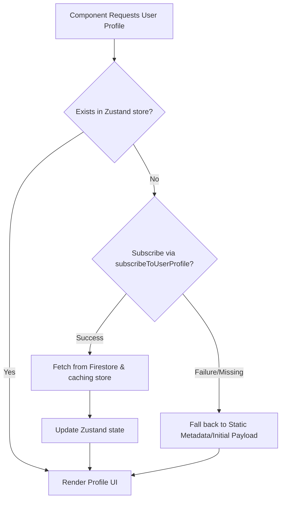

# Echoes: Group Memory Vault 📸✨

A private memory-sharing app that helps families, friends, and close groups preserve meaningful moments together — without the noise of social media.

Echoes enables users to create collaborative memory vaults, share photos and stories in real time, revisit nostalgic moments through "On This Day", and maintain a persistent shared history with the people who matter most.

> No public feeds. No algorithms. No likes. Just memories that matter.


---

## 🚀 Key Features

*   **🔒 Private Group Vaults:** Create invitation-only shared spaces to collaborate and share memories exclusively with close groups.
*   **⚡ Real-Time Collaboration:** Member profiles, shared memories, and vault updates sync instantly across all devices.
*   **🖼️ Nostalgia Engine ("On This Day"):** Automatically resurfaces past memories from previous years on the current calendar day.
*   **🔔 Smart Notifications:** Instantly get notified when new memories are shared or vault members interact, with full deep-linking support.
*   **🧹 Secure Asset Management:** Automatic cleanup of old media assets to maintain storage hygiene.
*   **🛡️ Hardened UI Components:** Optimized, fallback-protected media rendering designed to handle image load errors gracefully.

---

## 📱 Screenshots

| Vault List | Memory Detail | On This Day | Profile |
|------------|----------------|-------------|----------|
|  |  |  |  |

---

## 💻 Tech Stack

*   **React Native & Expo:** Cross-platform native application framework.
*   **TypeScript:** Type-safe development environment.
*   **Firebase Authentication:** Secure user credentials and identity management.
*   **Cloud Firestore:** Real-time, synchronized database.
*   **Firebase Storage:** Secure, scalable image and media hosting.
*   **Firebase Cloud Functions:** Event-driven backend services.
*   **Expo Notifications:** Device-native push notifications integration.
*   **Zustand:** Highly-performant, lightweight state management.
*   **React Navigation:** Declarative screen routes and deep link management.

---

## 🛠️ Technical Architecture

### 1. Targeted Real-Time Sync & Identity Cache
To avoid excessive Firestore read operations and prevent `N+1` database read storms, Echoes enforces a strict three-tier identity data enrichment priority:
*   **Zustand Store (`authStore` & `userStore`):** The single source of truth for UI state.
*   **Lazy Subscriptions:** Rather than querying full user records for every list item, the app lazily registers listeners (`subscribeToUserProfile`) for active peer profiles.
*   **Static Metadata & Cache Fallbacks:** If no cached subscription exists, the UI falls back to initial payload metadata or placeholder state.



### 2. Push Notification Pipeline
Echoes leverages an asynchronous notifications engine with built-in reliability features:
*   **Deduplication:** Device tokens are registered securely on the client, verifying and preventing duplicate storage entries.
*   **Stale Token Cleanup:** The background Cloud Functions engine batches push actions and automatically detects and purges expired or invalid push tokens from Firestore.
*   **Race-Condition Guards:** A deep-linking initialization router prevents navigation calls from executing before the React Navigation container is fully initialized.

### 3. Media Storage Hygiene & Hardened UI
*   **Asset Cleanup:** Whenever a user uploads a new avatar image, a Cloud Storage transaction identifies the previous media URL and schedules a prompt deletion (`deleteObject`) to prevent orphan files.
*   **Component Hardening:** Image loaders utilize fallback-protected custom renderers to display default visual placeholders in case of loading failures or network timeouts.

---

## 📂 Project Structure

```
Echoes-GMV/
├── android/                   # Native Android configurations
├── assets/                    # Static assets, fonts, icons
├── docs/                      # Documentation assets
│   └── screenshots/           # Screenshot placeholders
├── functions/                 # Firebase Cloud Functions (TypeScript)
│   ├── src/                   # Cloud Functions logic (token sync, triggers)
│   └── package.json
├── src/                       # Application Source Code
│   ├── algorithms/            # Utility sorting & filtering algorithms
│   ├── components/            # Reusable UI components (Avatar, Card, Button)
│   ├── constants/             # Centralized style themes & app constants
│   ├── hooks/                 # Custom React hooks (useNotifications, etc.)
│   ├── navigation/            # React Navigation routes (AppNavigator, BottomTab, Stack)
│   ├── screens/               # Screen Views:
│   │   ├── Auth/              # Login, Register, MemoryPreview
│   │   ├── Memory/            # MemoryDetailScreen
│   │   ├── Public/            # MemoryEntryScreen
│   │   ├── Resurface/         # OnThisDayScreen (Nostalgia Engine)
│   │   ├── Settings/          # ProfileScreen, EditProfileScreen
│   │   └── Vault/             # VaultList, VaultDetail, VaultMembersList
│   ├── services/              # External integrations (firebase, auth, userService)
│   ├── store/                 # Zustand state stores (authStore, userStore, vaultStore)
│   └── utils/                 # General helpers and formatters
├── App.tsx                    # React Native entry point
├── app.config.js              # Expo app configuration
├── firestore.rules            # Firestore security rules
├── storage.rules              # Firebase Storage security rules
└── package.json               # Package configuration & scripts
```

---

## ⚡ Setup & Installation

### Prerequisites
*   Node.js (v18+)
*   Expo CLI (`npm install -g expo-cli`)
*   Android Studio / Xcode (for simulator testing)
*   A Firebase Project

### 1. Clone & Install Dependencies
```bash
# Clone the repository
git clone https://github.com/prakyats/GMV.git
cd Echoes-GMV

# Install frontend dependencies
npm install

# Install Cloud Functions dependencies
cd functions && npm install
cd ..
```

### 2. Set Up Credentials
*   Cloud Functions require Firebase Admin credentials during local development.
*   Configure credentials securely using Firebase CLI authentication or environment variables.
*   **Never commit service account files to source control.**

---

## 🔑 Environment Variables

Create a `.env` file in the root folder based on `.env.example`:
```ini
EXPO_PUBLIC_FIREBASE_API_KEY=your_api_key
EXPO_PUBLIC_FIREBASE_AUTH_DOMAIN=your_auth_domain
EXPO_PUBLIC_FIREBASE_PROJECT_ID=your_project_id
EXPO_PUBLIC_FIREBASE_STORAGE_BUCKET=your_storage_bucket
EXPO_PUBLIC_FIREBASE_MESSAGING_SENDER_ID=your_messaging_sender_id
EXPO_PUBLIC_FIREBASE_APP_ID=your_app_id
```

---

## 🚀 Running the App

### Start Development Server
```bash
# Run Expo Dev Server
npm run start
```
You can scan the QR code using the Expo Go app on your physical device, or press `a` (Android) or `i` (iOS) to run it in a simulator.

### Run Native Environments
```bash
# Run on Android Emulator/Device
npm run android

# Run on iOS Simulator
npm run ios
```

---

## 🚢 Deployment

Before running the app in production, deploy security rules and backend cloud functions:
```bash
# Deploy Firestore & Storage rules
firebase deploy --only firestore:rules,storage:rules

# Deploy Cloud Functions
firebase deploy --only functions
```

---

## 🛡️ Security Rules

### Firestore Security Policies (`firestore.rules`)
*   **Users Collection:** Authenticated users can write only to their own document (`request.auth.uid == userId`). Public profiles can be read by other authenticated vault members.
*   **Vaults & Memories:** Strict membership-based validation. A user must be verified as a member of a vault to read or write memories or browse the membership list.

### Storage Security Policies (`storage.rules`)
*   **Profile Images:** Users can upload/delete assets under `profileImages/{userId}_*` only if their authenticated UID matches.
*   **Memory Media:** Restricts uploads to vault members, validating permission path mappings.

---

## 🛣️ Roadmap

- [ ] Time capsules
- [ ] Shared vault cover photos
- [ ] Memory reactions and comments
- [ ] Offline support
- [ ] iOS release
- [ ] Advanced search and filtering

---

## 📄 License

This project is licensed under the MIT License.

---

## 👥 Author

Built by [Prakyat Shetty](https://github.com/prakyats).

Contributions, suggestions, and feedback are welcome.
